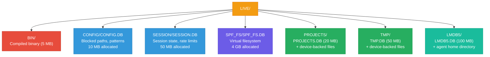

# LIVE/ — Runtime Data

This directory contains the compiled binary and all 6 LMDB databases. Created by `setup.sh` and populated at runtime.

## Directory contents

| Directory | Contains | Purpose |
|-----------|----------|---------|
| **BIN/** | `spf-smart-gate` binary + `spf-deploy.sh` | The compiled gate and deployment script |
| **CONFIG/CONFIG.DB/** | `data.mdb` + `lock.mdb` | Blocked paths, allowed paths, dangerous command patterns, tier config |
| **SESSION/SESSION.DB/** | `data.mdb` + `lock.mdb` + `cmd.log` | Session state, action history, persistent audit log |
| **SPF_FS/SPF_FS.DB/** | `data.mdb` + `lock.mdb` | Virtual filesystem — stores file metadata and content (small files inline, large files on disk) |
| **PROJECTS/PROJECTS.DB/** | `data.mdb` + `lock.mdb` | Project key-value store |
| **PROJECTS/PROJECTS/** | Actual files on disk | Device-backed project directory (AI-writable) |
| **TMP/TMP.DB/** | `data.mdb` + `lock.mdb` | Trust levels, access logs, resource tracking |
| **TMP/TMP/** | Actual files on disk | Device-backed temp directory (AI-writable) |
| **LMDB5/LMDB5.DB/** | `data.mdb` + `lock.mdb` | Agent memory, preferences, session context |
| **LMDB5/** | `.claude.json`, `.claude/`, `CLAUDE.md`, etc. | Agent's virtual home directory |

## Notes

- LMDB map sizes are **allocated virtual address space**, not resident memory. Actual disk/RAM usage scales with data written.
- Total allocation is ~4.2 GB (dominated by SPF_FS at 4 GB), but actual usage is much smaller until data accumulates.
- All `.mdb` files are LMDB databases — do not edit manually. Back up by copying the entire directory.

## Deep dive

See [Deployment Guide](../docs/deployment.md) for the full LIVE directory layout and LMDB size allocations.

---

## License

**Free for personal use.** Commercial use requires a paid license.

Licensed under the [PolyForm Noncommercial License 1.0.0](../LICENSE.md).
See [COMMERCIAL_LICENSE.md](../COMMERCIAL_LICENSE.md) for business use, or email **joepcstone@gmail.com**.

---

  Copyright 2026 Joseph Stone. All Rights Reserved. 
  <em>SPFsmartGATE and the StoneCell Processing Formula (SPF) are proprietary intellectual property.</em>

