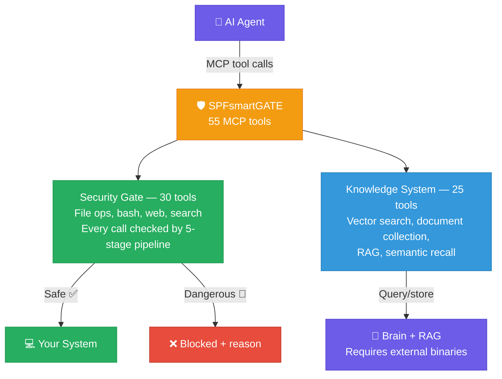
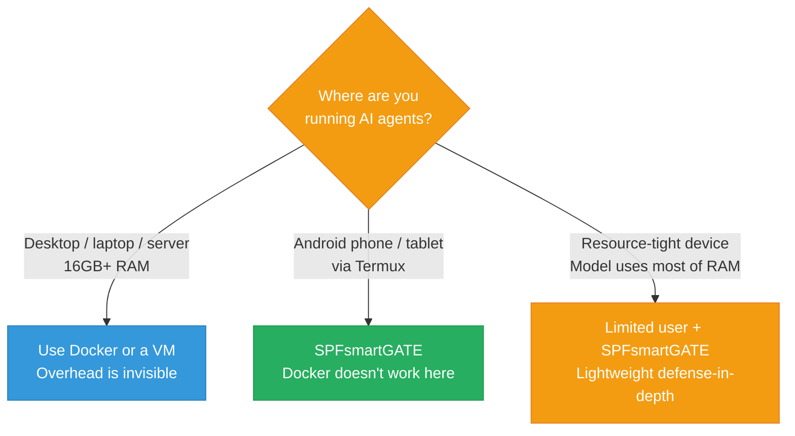
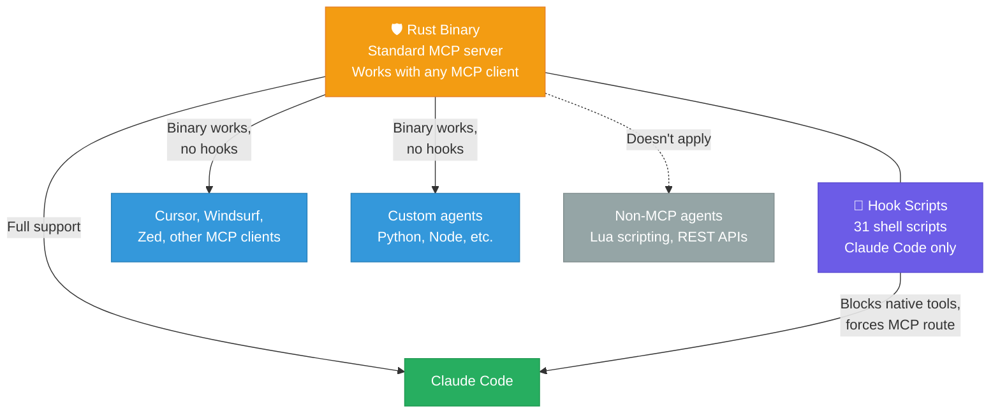

<p align="center">
  
</p>

<h1 align="center">SPFsmartGATE</h1>

<p align="center">
  <strong>A compiled MCP server for AI agents — security gate + knowledge management. Built in Rust.</strong>
</p>

<p align="center">
  <a href="LICENSE.md"></a>
  <a href="CHANGELOG.md"></a>
  <a href="https://www.rust-lang.org/"></a>
</p>

---

## What is this?

An MCP server that does two things: **security gating** and **knowledge management** for AI agents, in a single compiled Rust binary.



### The security gate (30 tools — ships standalone)

Every file read, write, bash command, and web request passes through a 5-stage security pipeline. The rules are in the compiled code, not in a prompt — no amount of clever text can override them. When something is blocked, the AI gets a specific error (`BLOCKED | tool | reason`) so it can change direction.

### The knowledge system (25 tools — requires external binaries)

9 Brain tools provide vector search and semantic recall via a separate Rust binary (`stoneshell-brain`). 16 RAG tools handle document collection, indexing, RSS feeds, and smart search via a Python server. These tools also pass through the security gate, but their purpose is building a persistent knowledge base — not security.

> **Important:** The Brain and RAG tools require external software not included in this repo. The security gate works fully standalone. See [how it works](docs/how-it-works.md) for details on what ships vs. what needs separate installation.

---

## Do you actually need this?

> **If you have a desktop or laptop with 16GB+ RAM: you probably don't.** Use Docker, a VM, or container sandboxing — it's simpler, more robust, and works with any model. SPFsmartGATE exists for environments where those options aren't available.

### The alternatives — and what they actually cost

| Approach | RAM overhead | Disk | Startup | Isolation strength |
|---|---|---|---|---|
| **Docker sandbox** | 100-200MB | 500MB+ image | 2-5s | Strong — full filesystem/network isolation |
| **Virtual machine** (QEMU/KVM, VirtualBox) | 512MB-2GB+ | 5-20GB image | 10-30s | Strongest — separate OS and kernel |
| **Firecracker / microVM** (E2B) | ~128MB | minimal | ~80ms | VM-level at container speed |
| **Limited Unix user + SPFsmartGATE** | ~20-50MB | 5MB binary | ~200ms | Medium — OS permissions + per-tool-call filtering |
| **Limited Unix user alone** | ~0 | ~0 | instant | Basic — just filesystem permissions |
| **Claude Code deny rules + hooks** | ~0 | ~0 | instant | Medium — deterministic tool blocking |

**If you have 32-128GB RAM, a GPU, and Docker installed — just use Docker.** On a machine with 128GB unified memory or 128GB RAM + 24GB VRAM, Docker's 200MB overhead is invisible. A VM's 2GB overhead is invisible. Use the strongest isolation available and don't think about it.

### Where the resource difference actually matters

On powerful hardware, resource overhead is irrelevant. But there are two scenarios where SPFsmartGATE's tiny footprint (~20-50MB RAM, 5MB disk, <10ms per gate check) genuinely matters:



- **Android/Termux** — Docker doesn't work here. If you're running Ollama or llama.cpp on your phone with MCP tool access, a compiled security gate is one of the few ways to prevent a 3B model from `rm -rf`-ing your storage. This is the primary use case.

- **Resource-tight devices where the model uses most of RAM** — if you're running a 7B model on a 8GB Raspberry Pi or Jetson Nano, Docker's 200MB overhead is 2.5% of total memory that could go to the model. A limited Unix user account (zero overhead) combined with SPFsmartGATE (20-50MB) gives you defense-in-depth for a fraction of the cost. On a Jetson Orin AGX with 32-64GB, this doesn't matter — just use Docker.

- **Quick-test of untrusted MCP agents** — you found a random agent framework on GitHub and want to try it without setting up a container. A limited user account + SPFsmartGATE lets you gate it in seconds.

### The limited user account approach

Something the other docs don't mention: a **limited Unix user account** is a zero-overhead security layer you can use with or without SPFsmartGATE.

```bash
# Create a restricted user for the agent
sudo useradd -m -s /bin/bash agent-sandbox
# Only give it access to a project directory
sudo mkdir -p /home/agent-sandbox/workspace
sudo chown agent-sandbox:agent-sandbox /home/agent-sandbox/workspace
# Run the agent as that user
sudo -u agent-sandbox spf-smart-gate serve
```

The OS prevents the agent from touching files it doesn't own. SPFsmartGATE adds per-tool-call filtering on top (dangerous command detection, credential scanning, rate limiting). Together they cost ~20-50MB total — vs Docker at 200MB+ or a VM at 512MB+.

**This only matters when you're counting megabytes.** On a machine with 32GB+ RAM, Docker is simpler and more robust. Use it.

**Scope limitation:** SPFsmartGATE only gates **MCP tool calls** (JSON-RPC over stdio). If your architecture has the model generate code (Lua, Python) that a separate runtime executes, the gate never sees those actions — you need to sandbox the runtime instead. See [threat model](docs/threat-model.md) for details.

Read more: **[Who needs this?](docs/threat-model.md)** — detailed use cases, platform-by-platform guide

---

## What can I actually use this with?

SPFsmartGATE has two layers, and they work with different things:



| Setup | What works | What doesn't |
|---|---|---|
| **Claude Code** (full setup) | Everything. Hooks block native tools (Read, Write, Bash, etc.) and force them through the Rust gate. The AI can't bypass security by using native tools instead of `spf_*` tools. | — |
| **Other MCP clients** (Cursor, Windsurf, custom agents) | The Rust binary works as a standard MCP server — any client that spawns a subprocess and talks JSON-RPC over stdio can connect. All 55 gated tools, all security checks, all LMDB tracking. | The hook scripts don't work. These clients have their own native tools, and there's nothing forcing them to use `spf_read` instead of their own `Read`. You'd need to configure the client to only use SPF tools. |
| **Non-MCP agents** (Lua scripting, REST-based, code generation) | Nothing. If the agent doesn't talk MCP, the gate never sees the actions. | Everything. Security needs to be in the executor layer instead. |

**Bottom line:** Full plug-and-play with Claude Code. Works as an MCP server with other clients but needs manual configuration. Irrelevant if MCP isn't in the picture.

Read more: **[Who needs this?](docs/threat-model.md)** — includes code-generation vs. MCP architecture comparison

---

## Quick start

```bash
git clone https://github.com/STONE-CELL-SPF-JOSEPH-STONE/SPFsmartGATE.git
cd SPFsmartGATE
bash setup.sh
./target/release/spf-smart-gate serve
```

> **Need Rust?** Install from [rustup.rs](https://rustup.rs/) first.

---

## Project structure

```
SPFsmartGATE/
├── src/                 # Rust source (15 modules, ~7,800 lines)
├── hooks/               # 31 shell scripts for monitoring
├── scripts/             # Setup and boot scripts
├── LIVE/                # Runtime data (databases, binaries)
├── docs/                # Technical documentation
├── config.json          # Runtime configuration
├── setup.sh             # One-command installer
└── build.sh             # Cross-platform build script
```

---

## Documentation

Start here and go deeper:

| Document | What you'll learn |
|----------|-------------------|
| **[Who needs this?](docs/threat-model.md)** | Risk by model type, real use cases, device-by-device platform guide |
| **[How it works](docs/how-it-works.md)** | 5-stage pipeline, architecture, blocked examples, the BLOCKED feedback loop |
| **[How it compares](docs/comparison.md)** | Claude Code overlap, MCP gateways, sandboxing, memory frameworks, honest gaps |
| [Why SPFsmartGATE?](docs/why-spf.md) | Feature highlights and design philosophy |
| [Developer Bible](docs/developer-bible.md) | Complete technical reference — every module, every feature |
| [MCP Tools Reference](docs/mcp-tools.md) | All 55 tools with parameters and examples |
| [Hook System](docs/hooks.md) | 31 monitoring scripts explained |
| [Deployment Guide](docs/deployment.md) | Building, installing, configuring |
| [Security Policy](SECURITY.md) | Vulnerability reporting |
| [Changelog](CHANGELOG.md) | Version history |

---

## License

**Free for personal use.** Commercial use requires a paid license.

Licensed under the [PolyForm Noncommercial License 1.0.0](LICENSE.md).
See [COMMERCIAL_LICENSE.md](COMMERCIAL_LICENSE.md) for business use, or email **joepcstone@gmail.com**.

---

<p align="center">
  Copyright 2026 Joseph Stone. All Rights Reserved.<br/>
  <em>SPFsmartGATE and the StoneCell Processing Formula (SPF) are proprietary intellectual property.</em>
</p>
