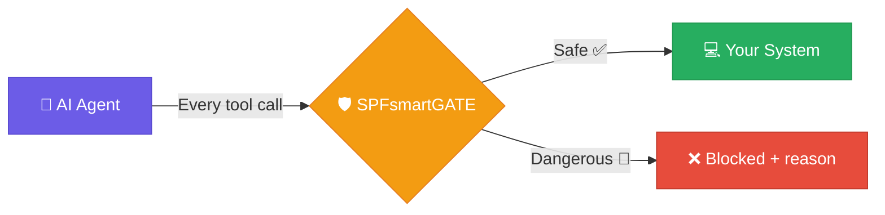
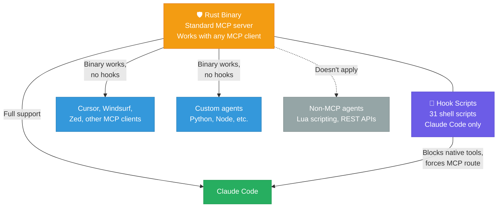

<p align="center">
  
</p>

<h1 align="center">SPFsmartGATE</h1>

<p align="center">
  <strong>A compiled security gate for AI agents. Built in Rust. Can't be talked out of doing its job.</strong>
</p>

<p align="center">
  <a href="LICENSE.md"></a>
  <a href="CHANGELOG.md"></a>
  <a href="https://www.rust-lang.org/"></a>
</p>

---

## What is this?

A compiled Rust binary that sits between an AI agent and your system. Every tool call — file reads, writes, bash commands, web requests — passes through a 5-stage security pipeline before execution. The rules are in the compiled code, not in a prompt. No amount of clever text can override them.



When something is blocked, the AI gets a specific error (`BLOCKED | tool | reason`) so it can change direction — not just fail silently.

---

## Do you actually need this?

**It depends on what models you're running.**

Frontier models (Claude, GPT-4o, Gemini Pro) have strong safety training — they don't go rogue in practice. People run `claude --dangerously-skip-permissions` for months without incidents. For those models, a compiled gate is overkill.

**The real risk is small, local, and uncensored models.** A 3B parameter model running on your phone through MCP will hallucinate tool calls, invent file paths, and attempt destructive commands. An "abliterated" fine-tune has its safety training deliberately removed. These models need a gate.

| Risk | Models | Need a gate? |
|---|---|---|
| **Low** | Claude, GPT-4o, Gemini Pro | Probably not |
| **Medium** | Llama 3 70B, Mistral Large | It helps |
| **High** | Small local models (0.5B-7B), uncensored fine-tunes, unknown MCP agents | **Yes** |

**SPFsmartGATE is most valuable where two things are true at once:**
1. The model lacks strong safety training
2. Docker/container sandboxing isn't available (primarily Android phones)

**Important scope limitation:** SPFsmartGATE only gates **MCP tool calls** — direct `tools/call` requests over JSON-RPC. If your architecture has the model generate code (Lua, Python, etc.) that a separate runtime executes, the gate never sees those actions. That's a fundamentally different pattern — common in game engines and scripting sandboxes — where security belongs in the executor layer, not the MCP layer. See [threat model](docs/threat-model.md) for details.

Read more: **[Who needs this?](docs/threat-model.md)** — detailed use cases, platform-by-platform guide

---

## What can I actually use this with?

SPFsmartGATE has two layers, and they work with different things:



| Setup | What works | What doesn't |
|---|---|---|
| **Claude Code** (full setup) | Everything. Hooks block native tools (Read, Write, Bash, etc.) and force them through the Rust gate. The AI can't bypass security by using native tools instead of `spf_*` tools. | — |
| **Other MCP clients** (Cursor, Windsurf, custom agents) | The Rust binary works as a standard MCP server — any client that spawns a subprocess and talks JSON-RPC over stdio can connect. All 55 gated tools, all security checks, all LMDB tracking. | The hook scripts don't work. These clients have their own native tools, and there's nothing forcing them to use `spf_read` instead of their own `Read`. You'd need to configure the client to only use SPF tools. |
| **Non-MCP agents** (Lua scripting, REST-based, code generation) | Nothing. If the agent doesn't talk MCP, the gate never sees the actions. | Everything. Security needs to be in the executor layer instead. |

**Bottom line:** Full plug-and-play with Claude Code. Works as an MCP server with other clients but needs manual configuration. Irrelevant if MCP isn't in the picture.

Read more: **[Who needs this?](docs/threat-model.md)** — includes code-generation vs. MCP architecture comparison

---

## Quick start

```bash
git clone https://github.com/STONE-CELL-SPF-JOSEPH-STONE/SPFsmartGATE.git
cd SPFsmartGATE
bash setup.sh
./target/release/spf-smart-gate serve
```

> **Need Rust?** Install from [rustup.rs](https://rustup.rs/) first.

---

## Project structure

```
SPFsmartGATE/
├── src/                 # Rust source (15 modules, ~7,800 lines)
├── hooks/               # 31 shell scripts for monitoring
├── scripts/             # Setup and boot scripts
├── LIVE/                # Runtime data (databases, binaries)
├── docs/                # Technical documentation
├── config.json          # Runtime configuration
├── setup.sh             # One-command installer
└── build.sh             # Cross-platform build script
```

---

## Documentation

Start here and go deeper:

| Document | What you'll learn |
|----------|-------------------|
| **[Who needs this?](docs/threat-model.md)** | Risk by model type, real use cases, device-by-device platform guide |
| **[How it works](docs/how-it-works.md)** | 5-stage pipeline, architecture, blocked examples, the BLOCKED feedback loop |
| **[How it compares](docs/comparison.md)** | Claude Code overlap, MCP gateways, sandboxing, memory frameworks, honest gaps |
| [Why SPFsmartGATE?](docs/why-spf.md) | Feature highlights and design philosophy |
| [Developer Bible](docs/developer-bible.md) | Complete technical reference — every module, every feature |
| [MCP Tools Reference](docs/mcp-tools.md) | All 55 tools with parameters and examples |
| [Hook System](docs/hooks.md) | 31 monitoring scripts explained |
| [Deployment Guide](docs/deployment.md) | Building, installing, configuring |
| [Security Policy](SECURITY.md) | Vulnerability reporting |
| [Changelog](CHANGELOG.md) | Version history |

---

## License

**Free for personal use.** Commercial use requires a paid license.

Licensed under the [PolyForm Noncommercial License 1.0.0](LICENSE.md).
See [COMMERCIAL_LICENSE.md](COMMERCIAL_LICENSE.md) for business use, or email **joepcstone@gmail.com**.

---

<p align="center">
  Copyright 2026 Joseph Stone. All Rights Reserved.<br/>
  <em>SPFsmartGATE and the StoneCell Processing Formula (SPF) are proprietary intellectual property.</em>
</p>
