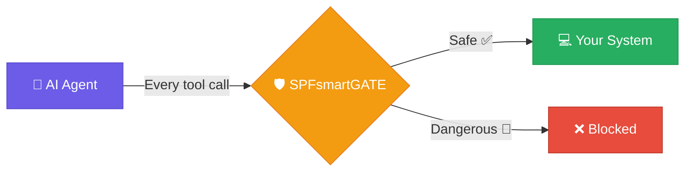
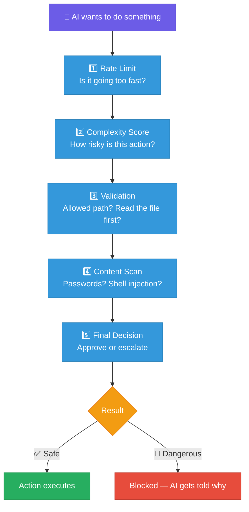
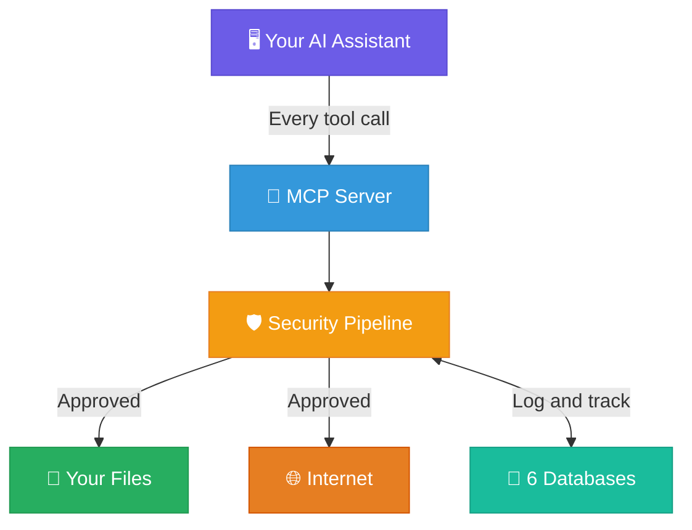

<p align="center">
  
</p>

<h1 align="center">SPFsmartGATE</h1>

<p align="center">
  <strong>A security guard for your AI coding assistant. Built in Rust. Can't be talked out of doing its job.</strong>
</p>

<p align="center">
  <a href="LICENSE.md"></a>
  <a href="CHANGELOG.md"></a>
  <a href="https://www.rust-lang.org/"></a>
</p>

---

## Do you actually need this?

**Honest answer: it depends on what models you're running.**

If you're using **Claude Opus/Sonnet through Anthropic's API**, you probably don't. These models have extensive safety training, and in practice they don't go rogue. People run `claude --dangerously-skip-permissions` for months of continuous autonomous use without incidents. The model itself is well-behaved enough that a compiled security gate is overkill for most workflows.

**The real risk isn't frontier models. It's everything else.**

The MCP protocol is model-agnostic — any AI agent that speaks MCP can call tools on your system. As local and open-source models become more capable, more people are plugging them into the same tool-calling infrastructure. These models don't have the same safety training:

| Risk level | Models | Do you need a gate? |
|---|---|---|
| **Low** | Claude Opus/Sonnet, GPT-4o, Gemini Pro | **Probably not.** Strong safety training. Well-behaved in practice. |
| **Medium** | Llama 3 70B, Mistral Large, Command R+ | **It helps.** Decent but less tested safety. More likely to make mistakes under complex prompts. |
| **High** | Small local models (0.5B-7B), uncensored fine-tunes (dolphin, abliterated), unknown third-party MCP agents | **Yes.** Weak or no safety training. Chaotic tool calls. This is what SPFsmartGATE is built for. |

### Where SPFsmartGATE earns its keep

- **Small local models on device** (0.5B - 7B running on phones, Raspberry Pi, edge hardware via Ollama/llama.cpp) — these models are chaotic. They hallucinate tool calls, invent file paths, and can attempt destructive commands because they lack the safety training of larger models. If you're running a 3B model on your phone through MCP, a compiled gate is the difference between "experimental" and "dangerous."

- **Uncensored/abliterated fine-tunes** — models like dolphin-mixtral or abliterated llama variants are built specifically to remove safety guardrails. People run them for good reasons (research, creative work, avoiding over-refusal), but giving them unrestricted tool access on your actual filesystem is genuinely risky.

- **Multi-agent chains** — when one model orchestrates others, the outer model might be safe but inner models might not be. A gate on the tool layer catches problems regardless of which model in the chain made the call.

- **Android/Termux development** — Docker sandboxing doesn't work reliably on mobile. If you're running local models on an Android device with MCP tool access, SPFsmartGATE is one of the few options for security gating in that environment.

- **Unknown third-party MCP agents** — random agent frameworks from GitHub that you want to try but don't fully trust. The gate lets you give them tool access with guardrails.

### Where you don't need it

- **Claude Code on Opus/Sonnet** — the model is well-behaved, Claude Code has built-in deny rules and approval prompts, and Docker sandboxing is available on desktop. Six months of `--dangerously-skip-permissions` with zero incidents is a real data point.

- **Any workflow where Docker sandboxing works** — container isolation is simpler and more robust than filtering individual tool calls. If Docker is an option, use Docker.

- **Standard desktop development with frontier models** — if you're using GPT-4, Claude, or Gemini Pro through their official APIs with normal safety settings, the models themselves are the guardrail.



## What it does

**SPFsmartGATE is a compiled Rust binary that sits between any MCP-speaking AI agent and your system.** Every tool call passes through a 5-stage security pipeline before execution. The AI can't override it — the rules are in the compiled code, not in a prompt.

> **Important caveat:** The full security model also depends on Claude Code hook scripts being configured correctly (the setup script handles this). The hooks redirect native tools through the gate. If hooks are misconfigured, native tools could bypass the gate. The Rust binary itself is solid — but it's one layer in a defense-in-depth system, not a magic bullet.

---

## What does it actually do?

Every AI action passes through **5 security checks** before it touches your system:



### Real examples of things it stops:

| What the AI tries to do | What happens | Why |
|---|---|---|
| `rm -rf /home` | **Blocked** | Dangerous command pattern detected |
| Write a file containing `AKIA...` (AWS key) | **Blocked** | Credential pattern found in content |
| Edit `/etc/hosts` | **Blocked** | Path is outside the allowed write list |
| Edit `app.py` without reading it first | **Blocked** | Read-before-write enforced at the gate level (also enforced natively by Claude Code's Edit tool) |
| 100 file writes in 30 seconds | **Blocked** | Rate limit: max 60 writes/minute |
| Fetch `http://169.254.169.254` (cloud metadata) | **Blocked** | SSRF protection — private IPs blocked |
| Read your source code | **Allowed** | Reads are safe and tracked for auditing |
| Write to your project folder | **Allowed** | Path is on the allowed list, file was read first |

---

## How it fits together



**Plain English version:**
1. You use an AI assistant in your terminal, like normal
2. The AI tries to read files, write code, run commands, or hit the web
3. SPFsmartGATE intercepts every action *before* it happens
4. The gate checks safety, logs what happened, and blocks anything dangerous
5. Safe actions go through — you don't even notice the gate is there

The AI doesn't know it's being gated. It just calls tools like `spf_read` and `spf_write` instead of the native ones. From its perspective, everything works normally. From your perspective, the dangerous stuff never happens.

---

## Key features

| Feature | What it means for you |
|---|---|
| **55 gated tools** | File ops, search, web, memory — all passing through security checks |
| **10 hard-blocked tools** | Filesystem tools that are too dangerous are permanently disabled |
| **Build Anchor Protocol** | Formalizes read-before-write into the gate pipeline (Claude Code's Edit tool also requires this natively) |
| **Persistent memory** | 6 LMDB databases for session/config/project state (note: Claude Code and other IDEs now have built-in memory too) |
| **Works 100% offline** | Everything except web tools runs locally — no cloud, no data leaving your device |
| **Cross-platform** | Battle-tested on Android/Termux; CI builds for Linux, macOS, Windows |
| **Single compiled binary** | Core gate is one Rust binary — but hook scripts need Python 3 for complexity calculation and state tracking |
| **43 security boundary tests** | Run `cargo test` to prove every protection works |

> **Note:** 9 Brain tools (vector search) and 16 RAG tools (document collection) are available but require separate external binaries not included in this repo. The core gate, all file/web/bash tools, and all security features work standalone.

---

## Quick start

```bash
# 1. Clone the repo
git clone https://github.com/STONE-CELL-SPF-JOSEPH-STONE/SPFsmartGATE.git
cd SPFsmartGATE

# 2. Run the setup script (handles everything)
bash setup.sh

# 3. Start the MCP server
./target/release/spf-smart-gate serve

# 4. In a new terminal, start Claude through the gate
HOME=~/SPFsmartGATE/LIVE/LMDB5 claude
```

> **Need Rust?** Install it from [rustup.rs](https://rustup.rs/) first.

### Manual build (if you prefer)

```bash
cargo build --release                     # Build the binary
./target/release/spf-smart-gate init-config  # Initialize databases
./target/release/spf-smart-gate serve        # Start the server
```

---

## CLI commands

| Command | What it does |
|---------|-------------|
| `serve` | Start the MCP security gateway |
| `status` | Show current gate status |
| `session` | Show session details |
| `calculate` | Check complexity score for a tool |
| `gate` | Process a single tool call |
| `reset` | Reset session state |
| `init-config` | Set up configuration database |
| `refresh-paths` | Reload blocked/allowed paths |

---

## Project structure

```
SPFsmartGATE/
├── src/                 # Rust source code (15 modules, ~7,800 lines)
├── hooks/               # 31 shell scripts for monitoring
├── scripts/             # Setup and boot scripts
├── LIVE/                # Runtime data (databases, binaries)
├── docs/                # Detailed technical documentation
│   ├── developer-bible.md   # Complete technical deep-dive
│   ├── mcp-tools.md         # All 55 tools explained
│   ├── hooks.md             # Hook system architecture
│   ├── deployment.md        # Build and deploy guide
│   ├── why-spf.md           # Feature highlights & philosophy
│   └── screenshots/         # Images and screenshots
├── config.json          # Runtime configuration
├── build.sh             # Cross-platform build script
├── setup.sh             # One-command installer
├── CHANGELOG.md         # Version history
├── SECURITY.md          # Vulnerability reporting
├── LICENSE.md           # PolyForm Noncommercial 1.0.0
├── COMMERCIAL_LICENSE.md # Commercial use terms
└── NOTICE.md            # Copyright and attribution
```

---

## Documentation

| Document | What's in it |
|----------|-------------|
| **[Why SPFsmartGATE?](docs/why-spf.md)** | Why this exists, what makes it different |
| **[Developer Bible](docs/developer-bible.md)** | Complete technical reference — every module, every feature |
| **[MCP Tools Reference](docs/mcp-tools.md)** | All 55 tools with parameters and examples |
| **[Hook System](docs/hooks.md)** | 31 monitoring scripts explained |
| **[Deployment Guide](docs/deployment.md)** | Building, installing, and configuring |
| **[Security Policy](SECURITY.md)** | How to report vulnerabilities |
| **[Changelog](CHANGELOG.md)** | What changed in each version |

---

## Where does this actually run?

SPFsmartGATE compiles to a single native binary. It runs on anything with a Linux terminal — but whether you *need* it depends on the device.

### Phones and tablets

| Device | Can it run? | Do you need it? |
|---|---|---|
| **Android phone/tablet (Termux)** | Yes — primary platform, battle-tested | **Yes.** Docker doesn't work here. If you're running local models (Ollama, llama.cpp) with MCP tool access on your phone, this is one of the few ways to gate them. |
| **iPhone / iPad** | **No.** iOS doesn't allow terminal apps or background binaries. | N/A — iOS sandboxes every app. There's no shared filesystem for an AI agent to access. |

### Single-board computers and edge devices

| Device | Can it run? | Do you need it? |
|---|---|---|
| **Raspberry Pi** | Yes — compiles to aarch64-linux | **Yes.** Pi users run small local models for home automation, coding, IoT. Docker is available but heavy on limited RAM. A lightweight compiled gate makes more sense here. |
| **NVIDIA Jetson** | Yes — aarch64-linux, same as Pi | **Yes.** Jetson runs local models with GPU acceleration. Same situation — lightweight gate beats a Docker container on constrained hardware. |
| **Other Linux SBCs** (Orange Pi, Rock, etc.) | Yes — if it runs Linux and has a Rust toolchain | Same as Pi/Jetson. Anywhere you're running local models on limited hardware. |

### Desktops and laptops

| Device | Can it run? | Do you need it? |
|---|---|---|
| **Linux desktop/laptop** | Yes — CI builds for x86_64 | **Probably not.** Docker works fine here. If you're using Claude/GPT through their APIs, the models are well-behaved and Docker sandboxing is the simpler answer. *Could* be useful if you're running uncensored local models without containers. |
| **macOS** | Yes — CI builds for Apple Silicon and Intel | **Probably not.** Same as Linux — Docker and Apple Container sandboxing work well. Built-in Claude Code security is usually enough. |
| **Windows** | Compiles via CI, least tested | **Probably not.** WSL2 + Docker is the standard approach. SPFsmartGATE hasn't been stress-tested here. |

### The pattern

**SPFsmartGATE is most valuable where two things are true at the same time:**
1. You're running models that lack strong safety training (small local models, uncensored fine-tunes)
2. Docker/container sandboxing isn't available or practical (phones, low-RAM SBCs, edge devices)

On a desktop with Docker and a frontier model, you don't need it.

---

## How this compares to other tools

There are other ways to solve the "keep the AI from breaking my system" problem. Here's an honest look at where SPFsmartGATE sits relative to them.

### Claude Code already does a lot of this

Claude Code's built-in security has gotten strong:
- **Deny rules** block specific tools/paths and are enforced even in bypass mode
- **PreToolUse hooks** can block any tool call via shell scripts — this is deterministic, not prompt-based
- **The Edit tool already requires a read first** — Claude Code natively refuses to edit a file you haven't read in the conversation
- **Docker sandboxing** is officially supported — runs the AI in an isolated container where it can't damage the host at all
- **[claude-code-permissions-hook](https://github.com/kornysietsma/claude-code-permissions-hook)** is an open-source TOML-configured hook that does regex path blocking and shell injection detection — similar scope to SPFsmartGATE's path/content scanning in a much smaller package

**Honest overlap:** ~60-70% of SPFsmartGATE's security features can be achieved with Claude Code's native tools. If you're on desktop and can use Docker, containerized sandboxing is arguably a simpler and more robust answer.

### MCP gateways

| Tool | What it does | How it compares |
|---|---|---|
| **[Lasso MCP Gateway](https://github.com/lasso-security/mcp-gateway)** (~288 stars) | MCP proxy with PII scanning, prompt injection detection, per-server risk scores | More mature plugin architecture; better PII detection |
| **IBM ContextForge** | MCP federation with RBAC, rate limiting, observability | Enterprise-focused, multi-tenant — different target audience |
| **Prompt Security MCP Gateway** | Dynamic risk scores across 13K+ MCP servers | Commercial; more comprehensive risk scoring |
| **Docker MCP Gateway** | Container isolation per MCP server | Stronger isolation model |

### Sandboxing (the "just put it in a box" approach)

| Tool | Stars | Approach |
|---|---|---|
| **[E2B](https://e2b.dev)** | ~11.1K | Firecracker microVMs, 80ms cold start. If the sandbox breaks, the host is untouched. |
| **Docker Sandboxes** | — | Official Claude Code support. Full filesystem/network isolation. |

Container sandboxing is a fundamentally different approach — instead of filtering individual actions, it isolates the entire environment. It's simpler and arguably more robust. **The main case where it doesn't work: Android/Termux**, where Docker is unreliable or unavailable.

### AI memory frameworks

Persistent AI memory is now a competitive space, not a gap:
- **Mem0** — dedicated memory layer with semantic search, 26% accuracy boost in benchmarks
- **Zep** — temporal knowledge graphs, enterprise-focused
- **Copilot Memory** — built into GitHub Copilot as of March 2026
- **Windsurf Memories** — built into Windsurf IDE
- **Claude Code auto-memory** — built into Claude Code
- **Dozens of MCP memory servers** on GitHub (mcp-memory-service, mcp-knowledge-graph, Hindsight, etc.)

SPFsmartGATE's 6 LMDB databases are a specific architectural approach, but the general concept of persistent AI memory is mainstream in 2026.

### What SPFsmartGATE actually adds

After all the overlap, here's what remains:

- **All-in-one integration** — path blocking, content scanning, rate limiting, session tracking, and persistent memory in a single compiled binary, configured once. Stitching together Claude Code deny rules + a permissions hook + a memory MCP server + Docker gets you similar coverage but requires assembling multiple tools.
- **Works on Android/Termux where Docker can't** — Docker is unreliable on Termux. If you develop on mobile, SPFsmartGATE gives you security gating that container approaches can't provide there. (Other AI tools do target Termux — OpenClaw, DroidClaw, agent-loop — but none focus on security gating specifically.)
- **Formalized workflow discipline** — the complexity scoring, tier system, and resource allocation formula are an opinionated framework for how an AI agent should approach tasks. Whether the specific formula is well-calibrated is debatable (the exponents are arbitrary and produce extreme values with small inputs), but the concept of "think more before acting on complex tasks" is sound.
- **Compiled Rust binary** — harder to tamper with at runtime compared to Node.js/Python gateways. Deterministic performance with no GC pauses during security checks.

### What it doesn't do that competitors do

- **No prompt injection detection** — Lasso and Rebuff AI detect prompt injection attacks; SPFsmartGATE doesn't
- **No PII scanning** — Lasso integrates Presidio for PII detection; SPFsmartGATE scans for credential patterns but not general PII
- **No container isolation** — if a tool call passes the gate, it executes with full access to your system within the allowed paths
- **No multi-tenant/team support** — IBM ContextForge and MintMCP handle this; SPFsmartGATE is single-user
- **Noncommercial license** — every major competitor uses Apache 2.0 or similar permissive licenses, which makes them easier to adopt

---

## Current limitations

- **Early project** — v2.0.0 is the first public release. The security features are real and tested, but it hasn't had wide community adoption yet.
- **Android-first** — primarily built and tested on Termux/Android. Other platforms compile via CI but haven't been stress-tested.
- **Hook dependency** — the full security model relies on Claude Code hooks being correctly configured. If hooks break, native tools can bypass the gate.
- **Python 3 required** — the Rust binary is standalone, but the hook system needs Python 3 for complexity calculation and state management.
- **Brain + RAG tools need external binaries** — 25 of the 55 tools require separate programs not included in this repo. The core 30 tools work standalone.
- **Single-user, Claude Code specific** — the hook layer is built for Claude Code's API. The Rust binary speaks standard MCP and works with any client, but you'd need to adapt the hook layer.
- **Complexity formula needs calibration** — the SPF formula exponents (1, 7, 10) are hand-tuned, not empirically derived. They produce extreme values with small inputs (3 dependencies = score of 2,187). The concept is sound but the specific numbers need real-world calibration.

---

## License

**Free for personal use.** Commercial use requires a paid license.

Licensed under the [PolyForm Noncommercial License 1.0.0](LICENSE.md).
See [COMMERCIAL_LICENSE.md](COMMERCIAL_LICENSE.md) for business use, or email **joepcstone@gmail.com**.

---

<p align="center">
  Copyright 2026 Joseph Stone. All Rights Reserved.<br/>
  <em>SPFsmartGATE and the StoneCell Processing Formula (SPF) are proprietary intellectual property.</em>
</p>
