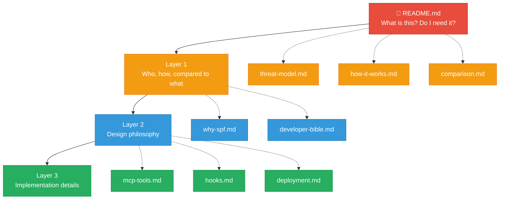

# SPFsmartGATE Documentation

Start broad, go deep. Each layer adds detail.

## Layer 1 — Why and who

| Document | Description |
|----------|-------------|
| [Who needs this?](threat-model.md) | Risk by model type, real use cases, device-by-device platform guide |
| [How it works](how-it-works.md) | 5-stage pipeline, architecture, blocked examples, BLOCKED feedback loop |
| [How it compares](comparison.md) | Claude Code overlap, MCP gateways, sandboxing, memory frameworks, honest gaps |

## Layer 2 — Design and philosophy

| Document | Description |
|----------|-------------|
| [Why SPFsmartGATE?](why-spf.md) | Feature highlights, value proposition, architectural advantages |
| [Developer Bible](developer-bible.md) | Complete technical reference covering all 13 system blocks |

## Layer 3 — Implementation details

| Document | Description |
|----------|-------------|
| [MCP Tools Reference](mcp-tools.md) | All 55 exposed tools with parameters, LMDB routing, and handler details |
| [Hook System](hooks.md) | Dual-layer hook architecture — 31 scripts for monitoring and enforcement |
| [Deployment Guide](deployment.md) | Build system, deployment scripts, config.json structure, LIVE directory layout |

## Screenshots

Screenshots from the Android/Termux deployment are in [screenshots/](screenshots/).

## Quick links

- [Main README](../README.md) — Project overview and quick start
- [Security Policy](../SECURITY.md) — Vulnerability reporting
- [Changelog](../CHANGELOG.md) — Version history
- [License](../LICENSE.md) — PolyForm Noncommercial 1.0.0
- [Commercial License](../COMMERCIAL_LICENSE.md) — Business use terms
