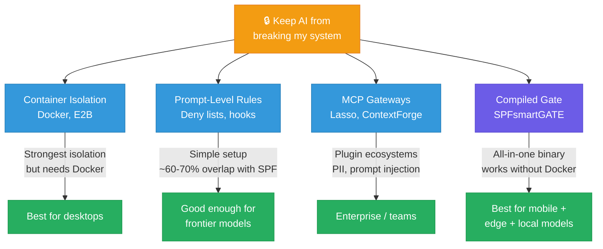
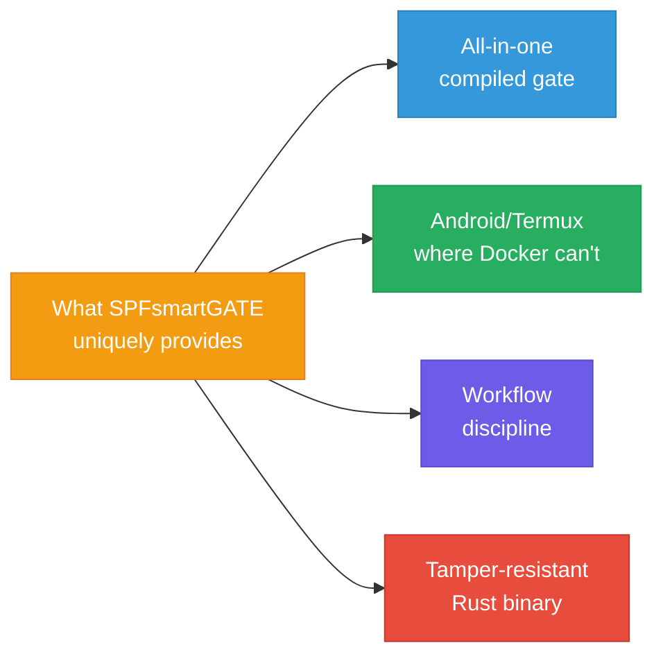

# How SPFsmartGATE compares

There are other ways to solve the "keep the AI from breaking my system" problem. Here's an honest look at where SPFsmartGATE sits relative to them.

---

## Claude Code already does a lot of this

Claude Code's built-in security has gotten strong:
- **Deny rules** block specific tools/paths and are enforced even in bypass mode
- **PreToolUse hooks** can block any tool call via shell scripts — this is deterministic, not prompt-based
- **The Edit tool already requires a read first** — Claude Code natively refuses to edit a file you haven't read in the conversation
- **Docker sandboxing** is officially supported — runs the AI in an isolated container where it can't damage the host at all
- **[claude-code-permissions-hook](https://github.com/kornysietsma/claude-code-permissions-hook)** is an open-source TOML-configured hook that does regex path blocking and shell injection detection — similar scope to SPFsmartGATE's path/content scanning in a much smaller package

**Honest overlap:** ~60-70% of SPFsmartGATE's security features can be achieved with Claude Code's native tools. If you're on desktop and can use Docker, containerized sandboxing is arguably a simpler and more robust answer.

---

## MCP gateways

| Tool | What it does | How it compares |
|---|---|---|
| **[Lasso MCP Gateway](https://github.com/lasso-security/mcp-gateway)** (~288 stars) | MCP proxy with PII scanning, prompt injection detection, per-server risk scores | More mature plugin architecture; better PII detection |
| **IBM ContextForge** | MCP federation with RBAC, rate limiting, observability | Enterprise-focused, multi-tenant — different target audience |
| **Prompt Security MCP Gateway** | Dynamic risk scores across 13K+ MCP servers | Commercial; more comprehensive risk scoring |
| **Docker MCP Gateway** | Container isolation per MCP server | Stronger isolation model |

---

## Sandboxing — the "just put it in a box" approach

**If you have the RAM and CPU for it, sandboxing is almost always the better answer.** It's a fundamentally different approach — instead of filtering individual tool calls, it isolates the entire environment. Simpler, more robust, harder to get wrong.

| Approach | What it does | Requirements |
|---|---|---|
| **Docker containers** | Full filesystem/network isolation. Official Claude Code support. If the AI breaks everything inside, your host is untouched. | Docker installed. Works on any desktop/laptop/server. ~200MB overhead. |
| **Virtual machines** (QEMU/KVM, VirtualBox, UTM) | Complete OS isolation — separate kernel, filesystem, network stack. The strongest isolation possible short of a separate physical machine. | 2-4GB+ RAM to spare. Heavier than Docker but bulletproof. Good for models you really don't trust. |
| **[E2B](https://e2b.dev)** (~11.1K stars) | Firecracker microVMs with ~80ms cold start. VM-level isolation at container-like speed. | Cloud/server deployments. Great for multi-tenant agent hosting. |
| **macOS containers** (Apple Containers) | Native lightweight VMs on Apple Silicon. | macOS only. Emerging support. |

**The main case where sandboxing doesn't work: Android/Termux.** Docker is unreliable there, and VMs aren't practical on a phone. That's the niche where SPFsmartGATE provides value — per-tool-call filtering when you can't isolate the whole environment.

### Resource cost comparison

| Approach | RAM overhead | Disk | Startup | Per-operation |
|---|---|---|---|---|
| **SPFsmartGATE** | ~20-50MB | 5MB binary | ~200ms | <10ms gate check |
| **Limited Unix user** (no gate) | ~0 | ~0 | instant | ~0 |
| **Limited Unix user + SPFsmartGATE** | ~20-50MB | 5MB | ~200ms | <10ms |
| **Docker container** | 100-200MB+ | 500MB+ image | 2-5s | negligible |
| **Virtual machine** | 512MB-2GB+ | 5-20GB | 10-30s | negligible |
| **Firecracker microVM** | ~128MB | minimal | ~80ms | negligible |

On a machine with 32-128GB RAM, these differences are meaningless — use Docker or a VM. On a device where the model is already using most of available memory (8GB Raspberry Pi running a 7B model, Android phone), the difference between 5MB and 500MB+ for the security layer matters.

### The lightweight combo: limited Unix user + SPFsmartGATE

A limited Unix user account is a zero-overhead security layer that works on any Unix system. The OS prevents the agent from touching files it doesn't own. SPFsmartGATE adds per-tool-call filtering on top (dangerous command patterns, credential scanning, rate limiting, read-before-write). Together: ~20-50MB total overhead, defense-in-depth, no containers required.

---

## AI memory frameworks

Persistent AI memory is now a competitive space, not a gap:
- **Mem0** — dedicated memory layer with semantic search, 26% accuracy boost in benchmarks
- **Zep** — temporal knowledge graphs, enterprise-focused
- **Copilot Memory** — built into GitHub Copilot as of March 2026
- **Windsurf Memories** — built into Windsurf IDE
- **Claude Code auto-memory** — built into Claude Code
- **Dozens of MCP memory servers** on GitHub (mcp-memory-service, mcp-knowledge-graph, Hindsight, etc.)

SPFsmartGATE's 6 LMDB databases are a specific architectural approach, but the general concept of persistent AI memory is mainstream in 2026.

---

## What SPFsmartGATE actually adds

After all the overlap, here's what remains:

- **All-in-one integration** — path blocking, content scanning, rate limiting, session tracking, and persistent memory in a single compiled binary, configured once. Stitching together Claude Code deny rules + a permissions hook + a memory MCP server + Docker gets you similar coverage but requires assembling multiple tools.

- **Works on Android/Termux where Docker can't** — Docker is unreliable on Termux. If you develop on mobile, SPFsmartGATE gives you security gating that container approaches can't provide there. (Other AI tools do target Termux — OpenClaw, DroidClaw, agent-loop — but none focus on security gating specifically.)

- **Formalized workflow discipline** — the complexity scoring, tier system, and resource allocation formula are an opinionated framework for how an AI agent should approach tasks. Whether the specific formula is well-calibrated is debatable (the exponents are arbitrary and produce extreme values with small inputs), but the concept of "think more before acting on complex tasks" is sound.

- **Compiled Rust binary** — harder to tamper with at runtime compared to Node.js/Python gateways. Deterministic performance with no GC pauses during security checks.

---

## What it doesn't do that competitors do

| Gap | Who does it |
|---|---|
| **Prompt injection detection** | Lasso, Rebuff AI |
| **PII scanning** | Lasso (Presidio integration) |
| **Container isolation** | E2B, Docker |
| **Multi-tenant / team support** | IBM ContextForge, MintMCP |
| **Permissive license** | Every major competitor (Apache 2.0 etc.) |

---

## Current limitations

- **Early project** — v2.0.0 is the first public release. The security features are real and tested, but it hasn't had wide community adoption yet.
- **Android-first** — primarily built and tested on Termux/Android. Other platforms compile via CI but haven't been stress-tested.
- **Hook dependency** — the full security model relies on Claude Code hooks being correctly configured. If hooks break, native tools can bypass the gate.
- **Python 3 required** — the Rust binary is standalone, but the hook system needs Python 3 for complexity calculation and state management.
- **Brain + RAG tools need external binaries** — 25 of the 55 tools require separate programs not included in this repo. The core 30 tools work standalone.
- **Single-user, Claude Code specific** — the hook layer is built for Claude Code's API. The Rust binary speaks standard MCP and works with any client, but you'd need to adapt the hook layer.
- **Complexity formula needs calibration** — the SPF formula exponents (1, 7, 10) are hand-tuned, not empirically derived. They produce extreme values with small inputs (3 dependencies = score of 2,187). The concept is sound but the specific numbers need real-world calibration.

---

Copyright 2026 Joseph Stone. All Rights Reserved.
