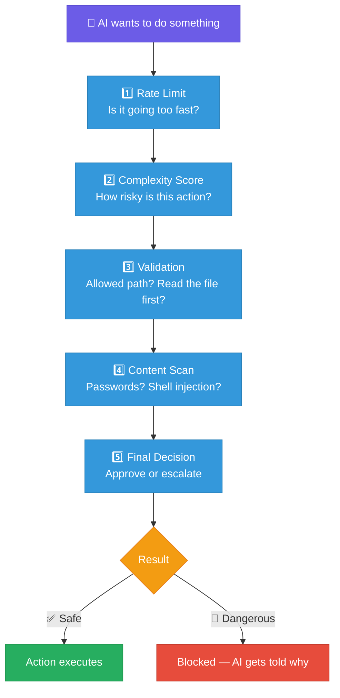
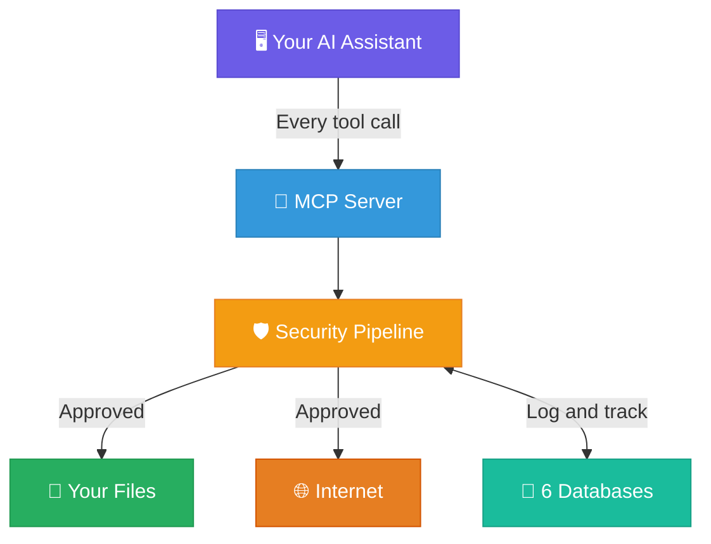
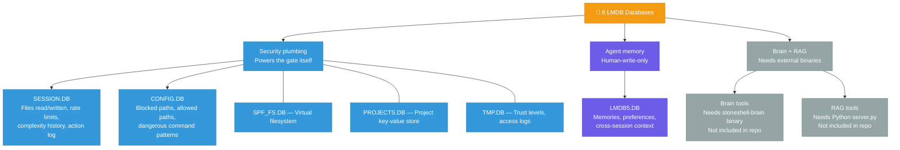

# How SPFsmartGATE works

SPFsmartGATE is a compiled Rust binary that sits between any MCP-speaking AI agent and your system. Every tool call passes through a 5-stage security pipeline before execution. The AI can't override it — the rules are in the compiled code, not in a prompt.

> **Important caveat:** The full security model also depends on Claude Code hook scripts being configured correctly (the setup script handles this). The hooks redirect native tools through the gate. If hooks are misconfigured, native tools could bypass the gate. The Rust binary itself is solid — but it's one layer in a defense-in-depth system, not a magic bullet.

---

## The 5-stage pipeline

Every AI action passes through **5 security checks** before it touches your system:

### What each stage does

| Stage | Module | What it checks |
|---|---|---|
| **Rate Limit** | `rate.rs` | Max 60 operations/minute. Prevents runaway loops. |
| **Complexity Score** | `calculate.rs` | Assigns a risk tier (SIMPLE → CRITICAL) based on what the tool does. Higher-tier actions get more scrutiny. |
| **Validation** | `validate.rs` | Is the path allowed? Is the command dangerous (`rm -rf`, `curl \| sh`)? Has the file been read before editing (Build Anchor)? |
| **Content Scan** | `inspect.rs` | Scans content for credential patterns (AWS keys, tokens), path traversal (`../../../etc/passwd`), shell injection. |
| **Final Decision** | `gate.rs` | Aggregates all checks. Approve, block, or flag for user review. |

---

## Architecture

**Plain English version:**
1. You use an AI assistant in your terminal, like normal
2. The AI tries to read files, write code, run commands, or hit the web
3. SPFsmartGATE intercepts every action *before* it happens
4. The gate checks safety, logs what happened, and blocks anything dangerous
5. Safe actions go through normally

---

## Real examples of things it stops

| What the AI tries to do | What happens | Why |
|---|---|---|
| `rm -rf /home` | **Blocked** | Dangerous command pattern detected |
| Write a file containing `AKIA...` (AWS key) | **Blocked** | Credential pattern found in content |
| Edit `/etc/hosts` | **Blocked** | Path is outside the allowed write list |
| Edit `app.py` without reading it first | **Blocked** | Read-before-write enforced at the gate level (also enforced natively by Claude Code's Edit tool) |
| 100 file writes in 30 seconds | **Blocked** | Rate limit: max 60 writes/minute |
| Fetch `http://169.254.169.254` (cloud metadata) | **Blocked** | SSRF protection — private IPs blocked |
| Read your source code | **Allowed** | Reads are safe and tracked for auditing |
| Write to your project folder | **Allowed** | Path is on the allowed list, file was read first |

---

## What happens when something is blocked?

The AI **does** find out. When the gate blocks an action, it sends back a specific error message explaining what was blocked and why:

- `BLOCKED | spf_write | path /etc/hosts is blocked` — the AI knows the path isn't allowed and can try a different location
- `BLOCKED | spf_edit | BUILD ANCHOR — must read file before editing` — the AI knows it needs to read the file first, then retry
- `BLOCKED | spf_bash | dangerous command pattern detected` — the AI knows the command was rejected and can try a safer approach
- `BLOCKED | unknown tool 'evil_tool' — not in gate allowlist` — the AI knows that tool doesn't exist in the system

This is important. A silent block would be useless — the AI would just keep retrying the same thing. Instead, the error message gives the AI enough information to **change direction**: use a different path, read the file first, rephrase the command, or ask the user for guidance. The gate blocks the dangerous action *and* teaches the AI why, so it can recover.

---

## Key features

| Feature | What it means |
|---|---|
| **55 gated tools** | File ops, search, web, memory — all passing through security checks |
| **10 hard-blocked tools** | Filesystem tools that are too dangerous are permanently disabled |
| **Build Anchor Protocol** | Formalizes read-before-write into the gate pipeline (Claude Code's Edit tool also requires this natively) |
| **Works 100% offline** | Everything except web tools runs locally — no cloud, no data leaving your device |
| **Cross-platform** | Battle-tested on Android/Termux; CI builds for Linux, macOS, Windows |
| **Single compiled binary** | Core gate is one Rust binary — but hook scripts need Python 3 for complexity calculation and state tracking |
| **43 security boundary tests** | Run `cargo test` to prove every protection works |

---

## The 6 databases — what they actually do

SPFsmartGATE has 6 LMDB databases. The docs list "persistent memory" as a feature, but here's what each one actually does and whether it matters to you:

### Security plumbing (ships with the binary, works out of the box)

| Database | What it does | Who uses it |
|---|---|---|
| **SESSION.DB** | Tracks files read/written this session, rate limit timestamps, complexity scores, action manifests. This is what powers Build Anchor (read-before-write) and rate limiting. | The gate itself — you don't interact with it directly. |
| **CONFIG.DB** | Stores blocked paths, allowed paths, dangerous command patterns, tier thresholds. Loaded at startup, queried on every tool call. | The gate reads it. You configure it via `config.json` or CLI. |
| **SPF_FS.DB** | A 4GB virtual filesystem in LMDB. Stores file content and metadata for the `spf_fs_*` tools (which are currently hard-blocked anyway). | Mostly unused in practice — the blocked FS tools route here. |
| **PROJECTS.DB** | Simple key-value store for project metadata. | Available via `spf_projects_*` tools — basic persistent storage. |
| **TMP.DB** | Trust levels, access logs, and resource tracking for the `/tmp/` and `/projects/` device mounts. | Internal bookkeeping for file operations on device-backed directories. |

**Bottom line:** SESSION and CONFIG are essential security plumbing. The other three are internal infrastructure that most users won't interact with directly.

### Agent memory (human-write-only)

| Database | What it does | The catch |
|---|---|---|
| **LMDB5.DB** | Stores memories (preferences, facts, instructions), cross-session context, and working state. The AI can search and read these memories. | The AI **cannot write** to it. `agent_remember`, `agent_forget`, and `agent_set_state` are all HARD BLOCKED from the AI — only the human can add memories via CLI. This is a deliberate security choice (prevents the AI from poisoning its own memory), but it means this isn't an automatic learning system. |

### Brain + RAG (requires external software not in this repo)

25 of the 55 tools (9 Brain + 16 RAG) call out to **external binaries that are not included**:
- **Brain tools** need `stoneshell-brain` — a separate Rust project that provides vector search via sentence transformers
- **RAG tools** need a Python `server.py` — a document collection and indexing server

Without these binaries installed separately, those 25 tools return errors. **The core security gate (30 tools) works fully standalone** — you only need the external binaries if you want vector search and document collection.

> **In context:** Claude Code, Copilot, Windsurf, and others all have built-in memory systems now. SPFsmartGATE's persistence layer is not a differentiator in 2026 — it's internal plumbing that supports the security gate. The gate itself is the value proposition.

---

Copyright 2026 Joseph Stone. All Rights Reserved.
