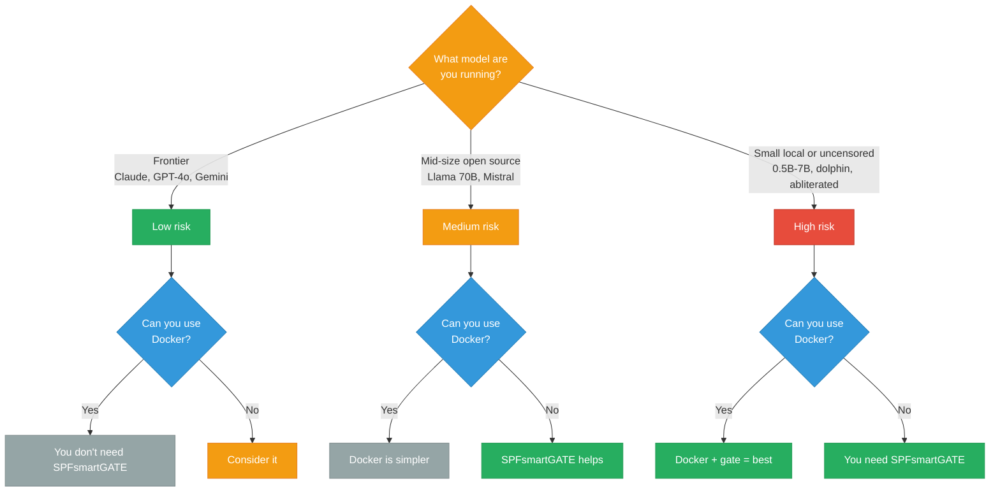
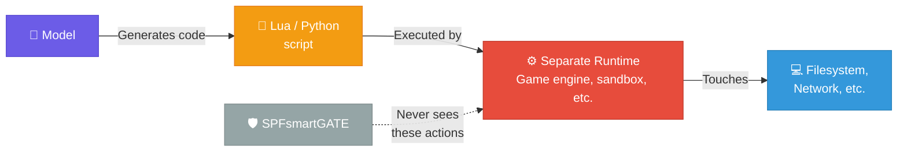
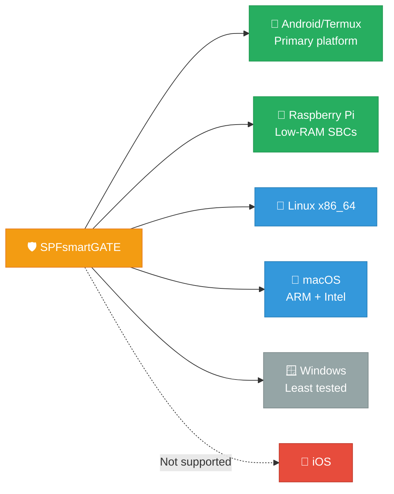

# Who needs SPFsmartGATE?

**Honest answer: it depends on what models you're running and where.**

If you're using Claude Opus/Sonnet through Anthropic's API, you probably don't. These models have extensive safety training, and in practice they don't go rogue. People run `claude --dangerously-skip-permissions` for months of continuous autonomous use without incidents. The model itself is well-behaved enough that a compiled security gate is overkill for most workflows.

**The real risk isn't frontier models. It's everything else.**

The MCP protocol is model-agnostic — any AI agent that speaks MCP can call tools on your system. As local and open-source models become more capable, more people are plugging them into the same tool-calling infrastructure. These models don't have the same safety training:

| Risk level | Models | Do you need a gate? |
|---|---|---|
| **Low** | Claude Opus/Sonnet, GPT-4o, Gemini Pro | **Probably not.** Strong safety training. Well-behaved in practice. |
| **Medium** | Llama 3 70B, Mistral Large, Command R+ | **It helps.** Decent but less tested safety. More likely to make mistakes under complex prompts. |
| **High** | Small local models (0.5B-7B), uncensored fine-tunes (dolphin, abliterated), unknown third-party MCP agents | **Yes.** Weak or no safety training. Chaotic tool calls. This is what SPFsmartGATE is built for. |

---

## Where SPFsmartGATE earns its keep

- **Small local models on device** (0.5B - 7B running on phones, Raspberry Pi, edge hardware via Ollama/llama.cpp) — these models are chaotic. They hallucinate tool calls, invent file paths, and can attempt destructive commands because they lack the safety training of larger models. If you're running a 3B model on your phone through MCP, a compiled gate is the difference between "experimental" and "dangerous."

- **Uncensored/abliterated fine-tunes** — models like dolphin-mixtral or abliterated llama variants are built specifically to remove safety guardrails. People run them for good reasons (research, creative work, avoiding over-refusal), but giving them unrestricted tool access on your actual filesystem is genuinely risky.

- **Multi-agent chains** — when one model orchestrates others, the outer model might be safe but inner models might not be. A gate on the tool layer catches problems regardless of which model in the chain made the call.

- **Android/Termux development** — Docker sandboxing doesn't work reliably on mobile. If you're running local models on an Android device with MCP tool access, SPFsmartGATE is one of the few options for security gating in that environment.

- **Unknown third-party MCP agents** — random agent frameworks from GitHub that you want to try but don't fully trust. The gate lets you give them tool access with guardrails.

## What clients does it actually work with?

The Rust binary and the hook scripts are two separate layers with different compatibility:

| Setup | How it works | Effort |
|---|---|---|
| **Claude Code** | Full support. `bash setup.sh` configures everything — hooks block native tools, force all actions through the Rust gate. Plug and play. | Just run setup. |
| **Cursor, Windsurf, Zed** (or any MCP client) | The Rust binary works as a standard MCP server — add it to the client's MCP config and the `spf_*` tools appear. All security checks work. | You need to configure the client to use `spf_read`/`spf_write`/`spf_bash` instead of its native tools. The hook scripts won't do this for you — they're Claude Code specific. |
| **Custom agents** (Python, Node, Rust) | Spawn `spf-smart-gate serve` as a subprocess, talk JSON-RPC 2.0 over stdin/stdout. You get all 55 gated tools. | You write the MCP client integration. The [MCP spec](https://modelcontextprotocol.io/) is straightforward. |
| **Non-MCP agents** (Lua scripting, REST APIs, code generation) | Doesn't apply. If the agent doesn't send MCP `tools/call` requests, the gate never sees the actions. | Use executor-level sandboxing instead (Docker, seccomp, WASM). |

**The hook layer is the Claude Code-specific part.** It intercepts Claude Code's native `Read`, `Write`, `Edit`, `Bash` etc. tools and blocks them (`exit 1`), forcing the AI to use `spf_read`, `spf_write`, `spf_edit`, `spf_bash` instead. Other MCP clients have their own native tools and would need their own equivalent redirect mechanism — or you'd configure the agent to only use `spf_*` tools directly.

**The Rust binary is the universal part.** It speaks standard MCP. Any client that can spawn a process and talk JSON-RPC over stdio can use it.

---

## Where you don't need it

- **Claude Code on Opus/Sonnet** — the model is well-behaved, Claude Code has built-in deny rules and approval prompts, and Docker sandboxing is available on desktop. Six months of `--dangerously-skip-permissions` with zero incidents is a real data point.

- **Any workflow where Docker sandboxing works** — container isolation is simpler and more robust than filtering individual tool calls. If Docker is an option, use Docker.

- **Standard desktop development with frontier models** — if you're using GPT-4, Claude, or Gemini Pro through their official APIs with normal safety settings, the models themselves are the guardrail.

- **Code-generation architectures (Lua, Python scripting, etc.)** — if the model generates code that a separate runtime executes, SPFsmartGATE has zero visibility into those actions. See below.

## When SPFsmartGATE doesn't apply at all

SPFsmartGATE gates **MCP tool calls** — the model says `tools/call spf_write` and the gate intercepts it. That's one specific architecture.

A different, equally common architecture: the model **generates code** (Lua, Python, JavaScript, etc.) and a separate executor runs it. Game engines, scripting sandboxes, and many agent frameworks work this way. In that pattern:

The gate sits on the MCP layer. If the dangerous action never goes through MCP, the gate is irrelevant. Security in code-generation architectures belongs in the **executor** — not the protocol layer:

- **Game engines** (Unity, Godot) sandbox Lua/GDScript with whitelisted API surfaces
- **Jupyter/IPython** can restrict kernel capabilities
- **Docker/Firecracker** isolate the entire execution environment
- **seccomp/AppArmor** restrict system calls at the OS level
- **WASM sandboxes** (Wasmtime, Wasmer) give memory-safe execution with no host access by default

This isn't a flaw in SPFsmartGATE — it's a scope boundary. MCP tool gating and code execution sandboxing solve different problems at different layers. If your AI agents talk MCP, SPFsmartGATE gates them. If they generate code for a runtime to execute, you need to sandbox the runtime.

---

## Where does it actually run?

SPFsmartGATE compiles to a single native binary. It runs on anything with a Linux terminal — but whether you *need* it depends on the device.

### Phones and tablets

| Device | Can it run? | Do you need it? |
|---|---|---|
| **Android phone/tablet (Termux)** | Yes — primary platform, battle-tested | **Yes.** Docker doesn't work here. If you're running local models (Ollama, llama.cpp) with MCP tool access on your phone, this is one of the few ways to gate them. |
| **iPhone / iPad** | **No.** iOS doesn't allow terminal apps or background binaries. | N/A — iOS sandboxes every app. There's no shared filesystem for an AI agent to access. |

### Single-board computers and edge devices

| Device | Can it run? | Do you need it? |
|---|---|---|
| **Raspberry Pi** (1-8GB RAM) | Yes — compiles to aarch64-linux | **Maybe.** Pi users run small local models for home automation, coding, IoT. Docker works on Pi but is heavy on 1-2GB models. On a Pi 5 with 8GB, Docker is fine — use that instead. On low-RAM Pis running small models, the lightweight gate makes more sense. |
| **NVIDIA Jetson** (Nano to Orin AGX) | Yes — aarch64-linux | **Probably not.** Jetsons are powerful — even the Nano has 4-8GB RAM, and the Orin AGX has 32-64GB with 275 TOPS. Docker runs fine on Jetson. Use container sandboxing. SPFsmartGATE would only add value if you specifically need MCP-level tool gating on top of containers. |
| **Other Linux SBCs** (Orange Pi, Rock, etc.) | Yes — if it runs Linux and has a Rust toolchain | Depends on RAM. Same logic as Pi — if Docker fits, use Docker. If you're RAM-constrained and running small models, the gate helps. |

### Desktops and laptops

| Device | Can it run? | Do you need it? |
|---|---|---|
| **Linux desktop/laptop** | Yes — CI builds for x86_64 | **Probably not.** Docker works fine here. If you're using Claude/GPT through their APIs, the models are well-behaved and Docker sandboxing is the simpler answer. *Could* be useful if you're running uncensored local models without containers. |
| **macOS** | Yes — CI builds for Apple Silicon and Intel | **Probably not.** Same as Linux — Docker and Apple Container sandboxing work well. Built-in Claude Code security is usually enough. |
| **Windows** | Compiles via CI, least tested | **Probably not.** WSL2 + Docker is the standard approach. SPFsmartGATE hasn't been stress-tested here. |

### The pattern

**SPFsmartGATE is most valuable where two things are true at the same time:**
1. You're running models that lack strong safety training (small local models, uncensored fine-tunes)
2. Docker/container sandboxing isn't available or practical (Android phones, very low-RAM SBCs)

In practice, this means **Android/Termux is the primary use case**. Most Linux devices powerful enough to run local models can also run Docker — and if Docker works, it's the simpler answer.

---

Copyright 2026 Joseph Stone. All Rights Reserved.
