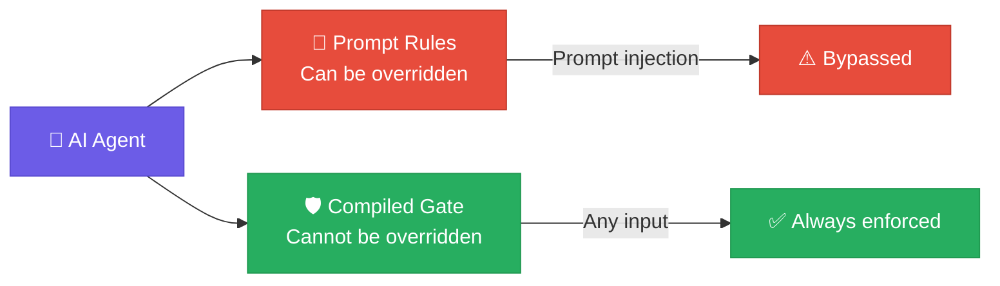
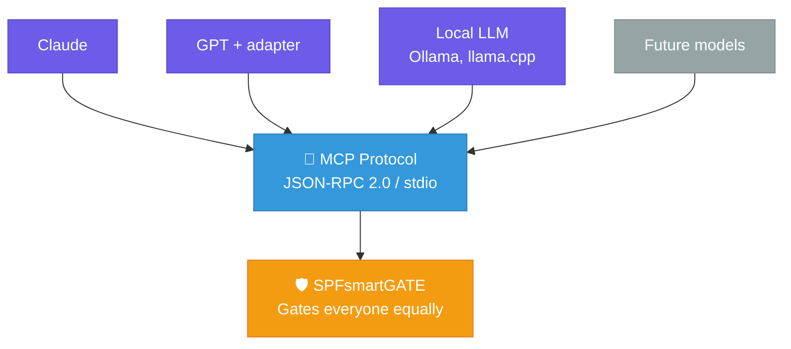
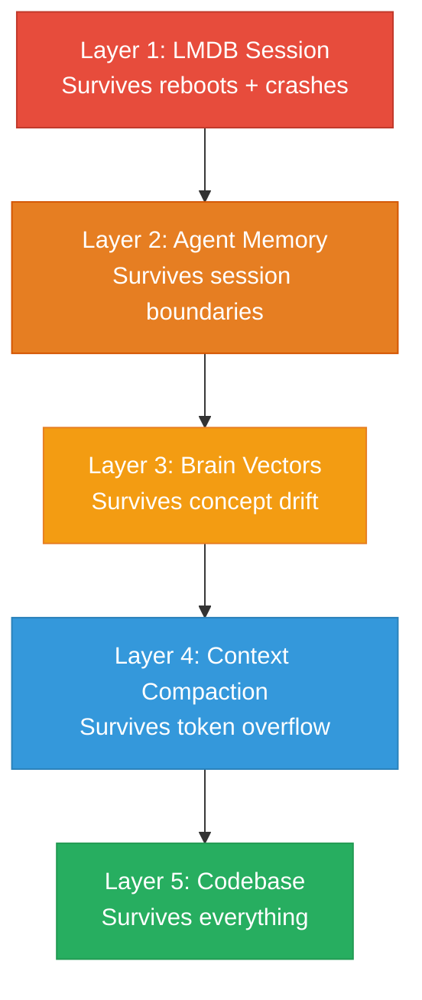
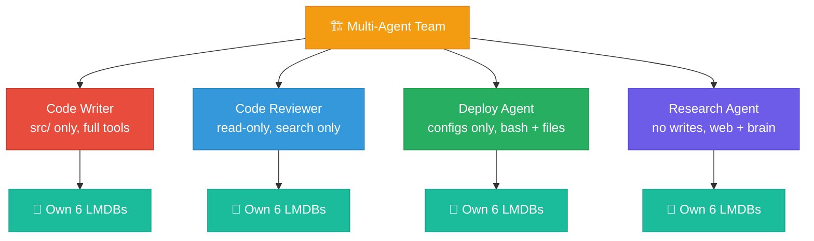

# Why SPFsmartGATE?

**The first compiled security gateway for AI agents.**

Every other AI safety tool works at the prompt level — telling
the AI what not to do. SPFsmartGATE works at the **execution
level** — preventing the action regardless of what the AI was
told. It's the difference between a "Please Don't Enter" sign
and a locked steel door.



---

## Binary Enforcement — Not Prompt-Based Safety

Most AI guardrails are text. A system prompt says "Don't delete
files." A clever prompt injection overrides that. SPFsmartGATE
is compiled Rust. No amount of clever text can make the binary
allow `rm -rf /`. It's physically impossible.

| Approach | How It Works | Bypassable via Prompt Injection? |
|----------|-------------|:-------------------------------:|
| System prompts | Text instruction to AI | **Yes** |
| Cloud API filters | Server-side content filtering | **Yes** — payload encoding |
| Sandbox containers | Process isolation | Partially — internal damage still possible |
| **SPFsmartGATE** | **Compiled binary gate on every tool call** | **No** |

The AI agent doesn't control the gate. The gate controls the
AI agent. Every tool call — every file read, every write, every
bash command, every web request — passes through a 5-stage
enforcement pipeline before execution.

---

## Why Rust?

These aren't generic Rust marketing points. They're specific
architectural advantages that matter for a security gateway.

### Single Static Binary
No Python. No Node.js. No Java. No runtime dependencies.
Copy one file, run it. The entire application — including LMDB
storage and TLS — is compiled into a single executable.

### No Garbage Collector
Every MCP tool call passes through the gate. A garbage collector
pause during a security check would add unpredictable latency.
Rust has no GC. Gate overhead is **predictable and sub-millisecond**.

### Memory Safety at Compile Time
This is a security tool. A buffer overflow or use-after-free in
the gate itself would be catastrophic. Rust eliminates these
classes of vulnerabilities at compile time — not through testing,
through the type system.

### Zero System Dependencies
- **LMDB**: Bundled via `lmdb-master3-sys` — compiles from C
  source. No system LMDB library required.
- **TLS**: Pure Rust via `rustls`. No OpenSSL. No system
  certificates. Mozilla CA bundle compiled in.
- **Result**: Build on any platform with a Rust toolchain.
  Nothing else needed.

### Zero-Cost Platform Support
Compile-time `cfg!()` branching means platform-specific code
(Windows blocked paths vs UNIX blocked paths) is eliminated by
the compiler on non-target platforms. The Linux binary contains
zero Windows code. The Windows binary contains zero UNIX code.
No runtime overhead for cross-platform support.

---

## MCP Protocol — Universal AI Compatibility



SPFsmartGATE implements the **Model Context Protocol (MCP)** —
the open standard for AI agent tool communication.

### Transparent to the AI Agent
From the AI's perspective, it's calling tools: `spf_read`,
`spf_write`, `spf_bash`. It doesn't know there's a security
gate. The gate intercepts, validates, and either passes through
or blocks — invisibly. This means:

- **Zero prompt engineering required** — You don't configure the
  AI to "be careful." The gate enforces it mechanically.
- **No cooperation needed** — The AI can't opt out of security
  checks. They happen at the binary level before execution.

### Works with Any MCP Client
Claude, GPT (via MCP adapters), local LLMs, future models —
any AI agent that speaks MCP gets gated automatically. SPF
doesn't care who's calling. It gates everyone equally.

### Future-Proof
As new AI models emerge, they adopt MCP for tool use.
SPFsmartGATE gates them on day one without modification.
The protocol is the interface. The gate is the enforcement.

### Simplest Possible Transport
JSON-RPC 2.0 over stdio. No ports to configure. No
authentication tokens between agent and gate. No networking
between components. Just stdin/stdout pipes — the most reliable
IPC mechanism in computing.

---

## 5-Layer Persistence Architecture



Most AI agents are stateless — every session starts from zero.
SPFsmartGATE provides 5 layers of persistent memory that
survive reboots, crashes, context overflow, and session
boundaries.

### Layer 1: LMDB Session State
**Survives: reboots, crashes, power loss**

Every action is recorded in an on-disk LMDB database: files
read, files written, tools called, timestamps, complexity
scores. Query with `spf_status` or `spf_session` to instantly
know where a session stands.

### Layer 2: Agent Memory (LMDB)
**Survives: session boundaries, days/weeks of inactivity**

Important decisions, discoveries, and context are stored as
searchable documents with tags. An agent can recall decisions
from previous sessions without re-exploration.

### Layer 3: Brain (Vector Search)
**Survives: concept drift**

Documents stored as vector embeddings enable semantic search.
Query by meaning, not keywords. "How does the gate handle web
requests?" finds SSRF documentation even though those exact
words aren't in the query.

### Layer 4: Context Compaction
**Survives: token window overflow**

When conversations exceed the AI's context window, structured
summaries preserve every file path, decision, error, and task
state. The AI resumes mid-flow without re-reading or re-asking.

### Layer 5: Codebase as Ground Truth
**Survives: everything**

The actual source files, commit messages, and test names encode
decisions permanently. If all other layers fail, the codebase
itself is the ultimate persistent state.

### How They Work Together
A new session loads the compacted summary (Layer 4), queries
LMDB state (Layer 1), optionally recalls agent memories
(Layer 2) or brain knowledge (Layer 3), and verifies against
the codebase (Layer 5). Result: the agent resumes mid-task in
seconds — not minutes.

**Without persistence:** 15–25 turns re-exploring before real
work begins. **With SPFsmartGATE:** 1–3 turns to full context.

---

## Multi-Instance Agent Specialization



Each SPFsmartGATE instance is entirely self-contained — its own
6 LMDB databases, its own configuration, its own brain. This
enables purpose-built agents with cryptographically separate
permissions:

| Agent Role | Write Access | Tools | Complexity Ceiling |
|-----------|-------------|-------|--------------------|
| **Code Writer** | `src/` only | Full tool set | CRITICAL allowed |
| **Code Reviewer** | None (read-only) | Read + search only | SIMPLE max |
| **Deploy Agent** | Deploy configs only | Bash + file ops | MEDIUM max |
| **Research Agent** | None | Web + brain only | LIGHT max |
| **Junior Agent** | Scoped directories | Limited tool set | SIMPLE max |

Each instance maintains independent:
- **Brain** — specialized knowledge base
- **Memory** — learned preferences and patterns
- **Blocked paths** — different security boundaries
- **Complexity tiers** — different risk tolerance
- **Session history** — separate audit trails

This isn't just a security tool. It's infrastructure for
**multi-agent teams** — each agent constrained to its role,
each auditable independently, none able to exceed its
permissions.

---

## Cost Efficiency

AI API costs are driven by **turns** — each turn resends the
entire conversation history. More turns = more tokens = higher
cost. SPFsmartGATE reduces turns in multiple ways:

### Prevented Failures
A blocked dangerous operation costs 1 turn. Without the gate,
that same operation would execute, break something, and require
4–6 turns to debug and fix.

### Build Anchor Protocol
Forcing the agent to read before writing prevents blind
modifications. Correct-on-first-try beats write-debug-rewrite.

### Complexity Gating
Tier classification prevents the agent from attempting
operations beyond its allocated budget. No spiraling 10-turn
recovery from an overly ambitious change.

### Session Persistence
Resuming from LMDB state + compacted context saves 15–25
exploration turns per session restart.

### Measured Impact
In complex development sessions, SPFsmartGATE reduces total
API turns by an estimated **25–35%** through prevented waste
and session continuity.

The larger cost saving: **catastrophic failure prevention**.
One unguarded `rm -rf ~` costs hours of recovery. One leaked
API key costs a full security rotation. SPF makes these events
physically impossible — not just unlikely.

---

## Security Without Compromise

### Fully Offline
Everything except web tools (`spf_web_*`) works without an
internet connection. LMDB operations, file management, bash
execution, brain search, session tracking — all local. Works
in air-gapped environments, on mobile, on unreliable
connections.

### No Cloud Dependency
Zero data leaves the device unless the AI explicitly calls a
web tool. No telemetry. No phone-home. No cloud dashboard.
No accounts. In an era where every AI tool wants to send your
code to a server — SPFsmartGATE is radically local.

### Portable State
LMDB databases are files on disk. Back them up, copy them to
another machine, clone an agent's entire memory and knowledge
to a new instance. Version-control your agent's brain state
if you want.

### Auditable
- **Source code is public** — verify what the gate does
- **Session LMDB logs every action** — complete behavioral
  audit trail with timestamps
- **43 unit tests prove security boundaries** — anyone can
  run `cargo test` to verify

### Hot-Swappable Configuration
Change `config.json`, restart the MCP server — new rules take
effect immediately. Adjust blocked paths, complexity tiers,
allowed tools, and dangerous command patterns without touching
Rust code or recompiling.

---

## Test Suite & CI/CD

### 43 Security Boundary Tests
Every critical enforcement layer is tested:

| Module | Tests | What's Covered |
|--------|:-----:|----------------|
| calculate.rs | 8 | Tier classification, complexity scoring, risk indicators |
| web.rs | 10 | SSRF: IPv4, IPv6, private networks, metadata endpoints |
| inspect.rs | 7 | Secrets, path traversal, shell injection detection |
| validate.rs | 7 | Dangerous commands, pipe-to-shell, temp access |
| gate.rs | 4 | Allow/deny logic, all 8 FS tools blocked |
| config.rs | 4 | Tier boundaries, defaults, blocked paths |
| fs.rs | 3 | Path normalization, virtual FS operations |

```bash
cargo test    # Run the full suite
```

### 4-Platform Automated Builds
GitHub Actions CI/CD pipeline builds on every tagged release:

| Platform | Target | Runner |
|----------|--------|--------|
| Linux x86_64 | x86_64-unknown-linux-gnu | ubuntu-latest |
| macOS Apple Silicon | aarch64-apple-darwin | macos-latest |
| macOS Intel | x86_64-apple-darwin | macos-latest (cross) |
| Windows x86_64 | x86_64-pc-windows-msvc | windows-latest |

Android aarch64 builds from source on Termux.

Anyone can also **build from source** for any Rust-supported
platform:

```bash
git clone https://github.com/STONE-CELL-SPF-JOSEPH-STONE/SPFsmartGATE.git
cd SPFsmartGATE
cargo build --release
```

---

## Documentation

| Document | Focus |
|----------|-------|
| [README.md](../README.md) | Architecture, installation, CLI reference |
| [Developer Bible](developer-bible.md) | Complete technical deep-dive — all 13 blocks |
| [MCP Tools](mcp-tools.md) | Full tool reference — 55 tools + parameters |
| [Hooks](hooks.md) | Hook system — 31 lifecycle scripts |
| [Deployment](deployment.md) | Build system, config, directory layout |
| [SECURITY.md](../SECURITY.md) | Security policy and reporting |
| [CHANGELOG.md](../CHANGELOG.md) | Version history |

---

## License

SPFsmartGATE is licensed under the
[PolyForm Noncommercial License 1.0.0](LICENSE.md).

**Personal, educational, and noncommercial use is free.**

**All commercial use requires a separate license.**
See [COMMERCIAL_LICENSE.md](COMMERCIAL_LICENSE.md) or contact
joepcstone@gmail.com for licensing inquiries.

---

Copyright 2026 Joseph Stone. All Rights Reserved.

The StoneCell Processing Formula (SPF) and SPFsmartGATE are
proprietary intellectual property.
