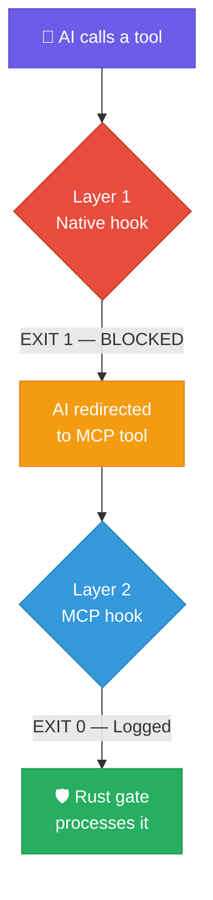

# hooks/ — Dual-Layer Shell Interceptors

31 shell scripts that intercept tool calls at two layers.

## How it works

**Layer 1** blocks Claude Code's native tools (exit 1), forcing the AI to use MCP equivalents that go through the Rust security gate. **Layer 2** logs MCP tool calls (exit 0) for audit trails. These hooks are **Claude Code specific** — other MCP clients would need their own redirect mechanism.

## Script inventory

### Session lifecycle (4 scripts)

| Script | Fires on | What it does |
|--------|----------|-------------|
| **session-start.sh** | Session start | Resets state, injects SPF context, boots LMDB5 |
| **session-end.sh** | Session end | Generates handoff note for cross-session continuity |
| **user-prompt.sh** | Every user message | Calculates prompt complexity, injects tier enforcement |
| **stop-check.sh** | Stop event | Saves session state, prevents recursive loops |

### Post-event (2 scripts)

| Script | Fires on | What it does |
|--------|----------|-------------|
| **post-action.sh** | After every tool call | Updates STATUS.txt, brain checkpoint on writes |
| **post-failure.sh** | After tool failure | Logs error to spf.log + failures.log |

### Layer 1: Native tool blockers (9 scripts)

All follow the same pattern — print BLOCKED message, exit 1:

| Script | Blocks | Redirects to |
|--------|--------|-------------|
| pre-read.sh | Native Read | spf_read |
| pre-write.sh | Native Write | spf_write |
| pre-edit.sh | Native Edit | spf_edit |
| pre-bash.sh | Native Bash | spf_bash |
| pre-glob.sh | Native Glob | spf_glob |
| pre-grep.sh | Native Grep | spf_grep |
| pre-notebookedit.sh | Native NotebookEdit | spf_notebook_edit |
| pre-webfetch.sh | Native WebFetch | spf_web_fetch |
| pre-websearch.sh | Native WebSearch | spf_web_search |

### Layer 2: MCP tool loggers (9 scripts)

All follow the same pattern — log to spf.log, exit 0:

pre-mcp-read.sh, pre-mcp-write.sh, pre-mcp-edit.sh, pre-mcp-bash.sh, pre-mcp-glob.sh, pre-mcp-grep.sh, pre-mcp-notebookedit.sh, pre-mcp-webfetch.sh, pre-mcp-websearch.sh

### Layer 2: LMDB domain loggers (7 scripts)

| Script | Domain | Tools covered |
|--------|--------|-------------|
| pre-brain.sh | Brain vector ops | 9 spf_brain_* tools |
| pre-rag.sh | RAG collector | 16 spf_rag_* tools |
| pre-agent.sh | Agent state | 5 spf_agent_* tools |
| pre-config.sh | Config DB | spf_config_paths, spf_config_stats |
| pre-projects.sh | Projects DB | 5 spf_projects_* tools |
| pre-tmp.sh | TMP DB | 4 spf_tmp_* tools |
| pre-spf-meta.sh | SPF meta | spf_calculate, spf_status, spf_session |

## Deep dive

See [Hook System docs](../docs/hooks.md) for detailed execution flows, state files, and security model.

---

## License

**Free for personal use.** Commercial use requires a paid license.

Licensed under the [PolyForm Noncommercial License 1.0.0](../LICENSE.md).
See [COMMERCIAL_LICENSE.md](../COMMERCIAL_LICENSE.md) for business use, or email **joepcstone@gmail.com**.

---

  Copyright 2026 Joseph Stone. All Rights Reserved. 
  <em>SPFsmartGATE and the StoneCell Processing Formula (SPF) are proprietary intellectual property.</em>

