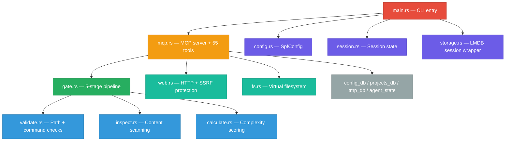

# src/ — Rust Source Code

15 modules, ~9,250 lines. This is the compiled security gate.

## Module reference

| Module | Lines | What it does |
|--------|------:|-------------|
| **mcp.rs** | 3,516 | MCP JSON-RPC server, all 55 tool handlers, LMDB routing |
| **agent_state.rs** | 683 | LMDB 5 — agent memory, preferences, session context |
| **fs.rs** | 666 | LMDB 1 — virtual filesystem with inline/disk hybrid storage |
| **tmp_db.rs** | 609 | LMDB 4 — trust levels, access logs, project resources |
| **main.rs** | 551 | CLI entry point, 12 subcommands (serve, status, gate, etc.) |
| **config_db.rs** | 517 | LMDB 2 — blocked paths, allowed paths, dangerous patterns |
| **validate.rs** | 510 | Path validation, dangerous command detection, Build Anchor |
| **web.rs** | 469 | HTTP client, SSRF protection (private IP blocking) |
| **calculate.rs** | 395 | Complexity formula, tier classification (SIMPLE→CRITICAL) |
| **gate.rs** | 332 | 5-stage security pipeline, rate limiting, final allow/deny |
| **config.rs** | 286 | SpfConfig struct, path validation helpers |
| **inspect.rs** | 213 | Content scanning — credentials, path traversal, shell injection |
| **session.rs** | 192 | In-memory session state — files read/written, manifests, failures |
| **storage.rs** | 100 | LMDB session persistence wrapper |
| **projects_db.rs** | 89 | LMDB 3 — project key-value store |
| **paths.rs** | 89 | Root directory discovery, platform detection |
| **lib.rs** | 34 | Module exports |

## How a tool call flows through the code

1. **main.rs** parses CLI args → `serve` subcommand → calls `mcp::run()`
2. **mcp.rs** reads JSON-RPC from stdin → dispatches `tools/call` to handler
3. Handler extracts params → calls **gate.rs** `process()`
4. **gate.rs** runs: rate limit → **calculate.rs** → **validate.rs** → **inspect.rs** → decision
5. If allowed: handler executes the action (file I/O, bash, web, LMDB)
6. Result sent back as JSON-RPC response on stdout

## Deep dive

See [Developer Bible](../docs/developer-bible.md) for complete technical reference covering every function and data structure.

---

## License

**Free for personal use.** Commercial use requires a paid license.

Licensed under the [PolyForm Noncommercial License 1.0.0](../LICENSE.md).
See [COMMERCIAL_LICENSE.md](../COMMERCIAL_LICENSE.md) for business use, or email **joepcstone@gmail.com**.

---

  Copyright 2026 Joseph Stone. All Rights Reserved. 
  <em>SPFsmartGATE and the StoneCell Processing Formula (SPF) are proprietary intellectual property.</em>

